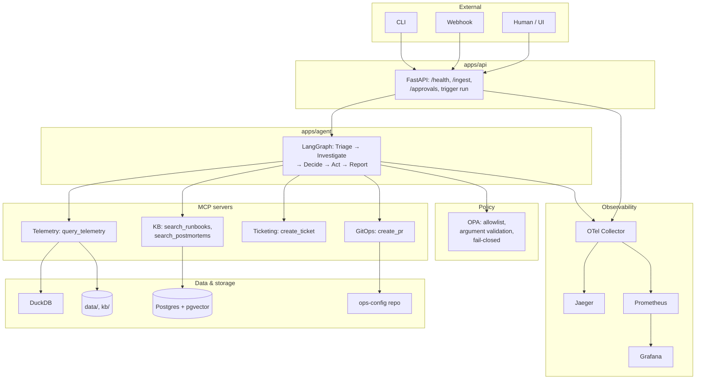

# Architecture overview

High-level architecture for the SpaceOps Mission Agent Lab: components, data flow, and key
technology choices. This document is an entry point and embeds the main Mermaid diagrams
inline for convenience.

- System architecture: `docs/architecture/system_architecture.mmd` (and `system_architecture_v2.mmd`)
- Repository structure: `docs/architecture/repo_structure.mmd`
- Production-ready criteria: `docs/architecture/production_ready_criteria.mmd`

For goals and requirements, see `roadmap/goals.md` (§4.5) and `roadmap/01-foundation-mvp.md`.

---

## Components

At a high level:

- **API (`apps/api`)**
  - FastAPI app exposing `/health`, `/ingest`, `/runs`, `/approvals`, `/metrics`.
  - Responsible for ingesting NDJSON telemetry/events, triggering agent runs, and serving
    approval and metrics endpoints.
- **Agent (`apps/agent`)**
  - LangGraph pipeline: **Triage → Investigate → Decide → Act → Report**.
  - Uses OpenAI Chat Completions via `httpx`; enforces limits/timeouts and escalation.
  - Integrates with MCP servers for telemetry, KB, Ticketing, and GitOps.
  - Uses OPA + approval API for restricted actions; writes audit entries and escalation packets.
- **MCP servers (`apps/mcp`)**
  - Telemetry MCP: serves telemetry queries from `data/telemetry/` (or Postgres) via `query_telemetry`.
  - KB MCP: RAG over runbooks/postmortems (DuckDB/pgvector), tools `search_runbooks` and `search_postmortems`.
  - Ticketing MCP: mock `create_ticket(title, body)` that appends to NDJSON.
  - GitOps MCP: mock `create_pr(repo_path, branch, files)` that writes/updates files under `ops-config/`.
- **OPA (Open Policy Agent)**
  - Runs as a sidecar/container (see `infra/docker-compose.yml`).
  - Policy bundle (`infra/opa/agent_policy.rego`) defines allowlist + argument validation for restricted actions.
  - Agent calls `POST /v1/data/agent/allow` and treats any non-allow result as deny (fail-closed).
- **Storage**
  - **Postgres + pgvector**: backing store for KB/RAG, via `psycopg2-binary` + `pgvector`.
  - **DuckDB**: optional analytics / local fixture queries.
  - **data/**: NDJSON telemetry, audit log, incident artifacts, approvals store, LLM observability NDJSON.
  - **ops-config/**: GitOps target subtree for config changes (alerts, channels, etc.).
- **Observability**
  - **OTel + Jaeger**: traces from API/agent via OpenTelemetry SDK, exported to Collector and visualised in Jaeger.
  - **Prometheus + Grafana**: metrics from `/metrics` endpoint; dashboards for run volume, latency, errors, tool calls.
  - **LLM observability spine**: `apps/llm_observability.py` writes NDJSON (`data/llm_runs/`) and enriches spans.

---

## Data flow

The main runtime path (see also `docs/workflow/end_to_end_pipeline.mmd`):

1. **Ingest**
   - Webhook/CLI sends NDJSON to `POST /ingest` on the API.
   - API validates and persists data under `data/` (and optionally Postgres/DuckDB).
2. **Trigger run**
   - Operator or upstream system calls `POST /runs` with `incident_id` + `payload`.
   - API constructs an initial `AgentState` and hands it to the LangGraph pipeline.
3. **Triage (Agent)**
   - Triage classifies the incident into `subsystem` + `risk` using an LLM call,
     persists an incident record under `data/incidents/`, and logs a span.
4. **Investigate (Agent + MCP)**
   - Investigate calls Telemetry MCP and KB MCP over HTTP (MCP protocol) to retrieve
     telemetry samples, runbook snippets, and postmortem entries.
   - It builds `hypotheses` (notes) and `citations` (structured references) attached to
     the agent state.
5. **Decide (Agent + LLM)**
   - Decide uses a prompt from `prompts/registry.py` to generate a plan: an array of steps
     with `action`, `safe`, `action_type`, and citations (`doc_ids`/`snippet_ids`).
   - Plan is recorded in the agent state; LLM observability logs the call (model, prompt ID,
     version, run_id).
6. **Act (Agent + OPA + MCP + approvals)**
   - For `safe=true` steps:
     - `create_ticket` → Ticketing MCP (append to NDJSON).
     - `create_pr` → GitOps MCP (write/update files under `ops-config/`).
   - For `safe=false` steps (`change_config`, `restart_service`):
     - Agent calls OPA with `{incident_id, step}` and interprets result strictly:
       only boolean `true` is allow; all else is deny.
     - On **allow**: agent creates an approval request (file in `data/approvals/`), but
       does **not** execute the action yet.
     - On **deny** / error / timeout: agent escalates with `reason="policy_deny"` and
       does not create an approval or execute anything.
7. **Human approval + execution**
   - Separate API calls (`GET /approvals`, `POST /approvals/:id/approve|reject`) let humans
     approve or reject restricted actions; execution happens only on approve.
   - Execution writes outcomes to audit and, for config changes, updates `ops-config/` via
     GitOps MCP.
8. **Report**
   - Final Report includes executive summary, evidence, citations, proposed actions,
     act results, approvals, escalation packet (if any), and a trace link to Jaeger.
   - Report is returned from `/runs` and can be used as the operator-facing artifact.

---

## Tech choices (rationale)

- **LangGraph for agent orchestration**
  - Explicit graph of nodes with a TypedDict state simplifies reasoning about pipeline
    behaviour, branching, and escalation.
  - Composable nodes make it easy to test pieces (Triage, Investigate, Decide, Act,
    Report) and integrate future nodes (e.g. post-incident automation).
- **MCP (Model Context Protocol) for tools**
  - Provides a standard, transport-agnostic way to expose Telemetry/KB/Ticketing/GitOps
    tools to the agent.
  - Decouples agent logic from concrete HTTP/DB schemas; makes it easier to swap or add
    backends without changing agent code.
- **OPA for policy (restricted actions)**
  - Central, auditable policy layer for deciding which restricted actions are allowed.
  - Rego policies are easier to evolve and review than hard-coded conditionals scattered
    across the agent.
  - Fail-closed semantics (deny on error/timeout) are critical for safety.
- **RAG on pgvector / DuckDB**
  - pgvector in Postgres gives a simple vector store co-located with structured data.
  - DuckDB is used for local analytics or fixture-driven experiments.
- **GitOps for config changes**
  - Changes to config (thresholds, channels) are materialised as file edits in `ops-config/`,
    which can later be wired to real PRs in a Git repo.
  - Enables reviewable, auditable config changes rather than live mutation.
- **Observability stack (OTel, Jaeger, Prometheus, Grafana)**
  - OTel + Jaeger for request/trace-level visibility: which nodes ran, which tools were
    called, where time was spent.
  - Prometheus + Grafana for aggregate metrics (run volume, latency, errors, tool usage).
  - Together with the audit log and LLM observability NDJSON, this satisfies NF7/F10-style
    requirements around traceability and debugging.

---

## Cross-links

- **Goals and requirements:** `roadmap/goals.md`, especially §4.5 (production-ready criteria).
- **Execution plan:** `roadmap/01-foundation-mvp.md`, `roadmap/01-core/README.md`.
- **Diagrams index:** `docs/README.md` (`architecture/`, `workflow/`, `agent/` sections).

