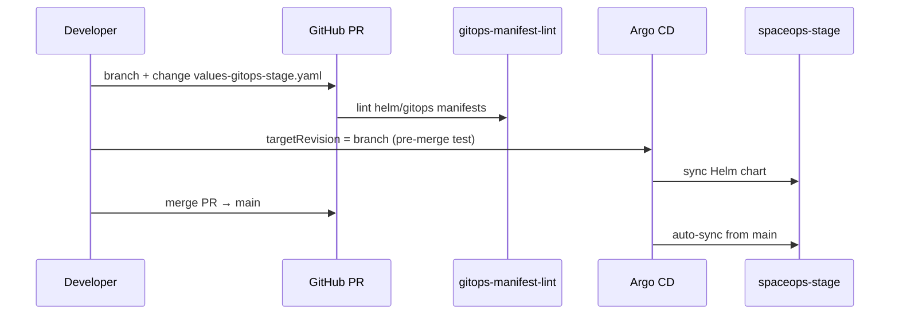

# GitOps + PR demo (GKE stage)

Test **Argo CD** promotion and **PR CI** on the live `spaceops-stage` cluster.

**Prerequisites:** GKE cluster up, `spaceops-stage-secrets` exists, images in Artifact Registry (`:stage`).

---

## Flow overview



| Step | What |
|------|------|
| **PR** | CI validates `deploy/gitops/**` + `values-gitops-*.yaml` |
| **Pre-merge** | Point Argo `targetRevision` at PR branch |
| **Post-merge** | `targetRevision: main` — stage auto-syncs |

---

## 1. Push a PR branch (promotion change)

GitOps image pins live in `deploy/helm/spaceops/values-gitops-stage.yaml` — **no secrets**.

```powershell
git checkout -b gitops/demo-stage-tag
# Example promotion marker (bump tag or add api.extraEnv in values-gitops-stage.yaml):
#   images.api.tag: stage-gitops-demo
git add deploy/helm/spaceops/values-gitops-stage.yaml deploy/gitops/
git commit -m "gitops: stage image pin demo for Argo CD"
git push -u origin gitops/demo-stage-tag
gh pr create --title "gitops: stage Argo CD demo" --body "PS6.7 PR + sync test"
```

PR triggers workflow **gitops-manifest-lint** (helm template + `tests/test_gitops_ps67.py`).

---

## 2. Install Argo CD on GKE (once)

```powershell
kubectl config current-context   # gke_..._spaceops-stage
make gitops-install
```

UI:

```powershell
kubectl port-forward svc/argocd-server -n argocd 8080:443
# https://localhost:8080  user: admin
# password:
kubectl get secret argocd-initial-admin-secret -n argocd -o jsonpath='{.data.password}' | ForEach-Object { [Text.Encoding]::UTF8.GetString([Convert]::FromBase64String($_)) }
```

---

## 3. Bootstrap Applications (PR branch)

Argo reads manifests from **Git**, not your laptop. Use the **PR branch** before merge:

```powershell
$env:GITOPS_REPO_URL = "https://github.com/Adam-Palacz/spaceops_mission_agent_lab.git"
$env:GITOPS_TARGET_REVISION = "gitops/demo-stage-tag"

make gitops-bootstrap
make gitops-status
kubectl get applications -n argocd
```

Ensure `deploy/gitops/argocd/applications/values.yaml` has `gcp.enabled: true` and your `projectId`
on the branch (GKE Artifact Registry paths).

---

## 4. Handoff from imperative Helm

If `helm list -n spaceops-stage` shows an existing release, release ownership:

```powershell
make gitops-handoff
# or dry-run: python scripts/gitops_bootstrap.py handoff --dry-run
```

Then wait for Argo:

```powershell
kubectl get applications -n argocd -w
kubectl get pods -n spaceops-stage -w
```

**Postgres schema** after first Argo sync:

```powershell
kubectl exec -n spaceops-stage deploy/spaceops-api -- python -m alembic upgrade head
kubectl rollout restart deploy/spaceops-telemetry-persister -n spaceops-stage
```

---

## 5. Sync / rollout demo

After pushing a tag change to the tracked branch:

```powershell
make gitops-rollout-demo GITOPS_DEMO_ARGS=--sync-only
# or: python scripts/gitops_rollout_demo.py --sync-only
kubectl get deployment spaceops-api -n spaceops-stage -o jsonpath='{.spec.template.spec.containers[0].image}'
```

---

## 6. Merge PR → production path on stage

1. Merge PR to `main`.
2. Update root app revision (if still on branch):

   ```powershell
   $env:GITOPS_TARGET_REVISION = "main"
   make gitops-bootstrap
   ```

3. Stage Application has **automated sync + selfHeal** — changes apply within ~3 min.

**Rollback:** `git revert` + push → Argo syncs previous tag (same as [k8s_rollout_rollback.md](k8s_rollout_rollback.md)).

---

## 7. Drift demo (optional)

```powershell
kubectl set env deployment/spaceops-api DEMO_DRIFT=1 -n spaceops-stage
# With selfHeal: Argo reverts on next reconcile
argocd app sync spaceops-stage --grpc-web   # if CLI installed
```

---

## Related

- [gitops_bootstrap.md](gitops_bootstrap.md)
- [gcp_stage_deploy.md](gcp_stage_deploy.md)
- [ADR 0008](../adr/0008-gitops-argocd.md)
