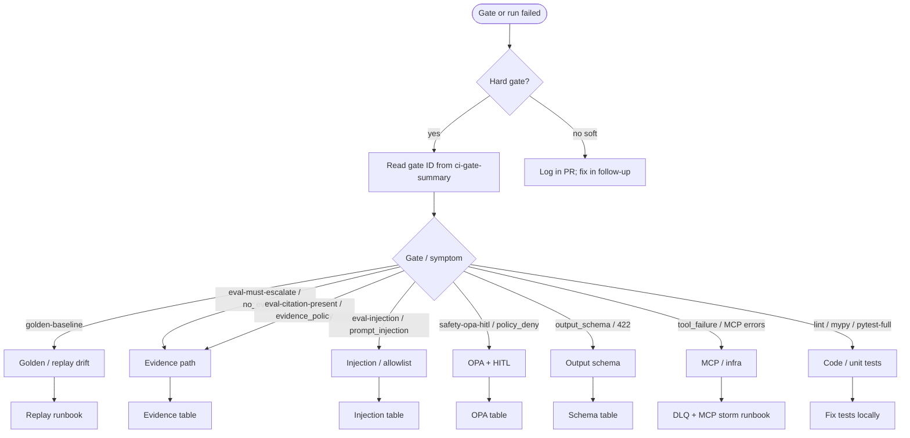

# Guardrails and quality triage (PS4.8)

Operator runbook for **failed CI gates**, **unexpected escalations**, and **quality regressions** after PS4 hardening. You do not need to read agent source code first — follow the steps, use the decision tree, then drill into linked runbooks only when routed.

**Related (do not duplicate here):**

| Topic | Runbook |
|--------|---------|
| Which CI jobs block merge | [ci_gating_policy.md](ci_gating_policy.md) (PS4.7) |
| Replay / golden diff | [replay_workflow.md](replay_workflow.md), [golden_run_baselines.md](../golden_run_baselines.md) |
| Telemetry queue / DLQ | [queue_dlq_recovery.md](queue_dlq_recovery.md) |
| MCP outages / storm | [queue_dlq_recovery.md § MCP storm](queue_dlq_recovery.md#8-mcp-storm--breaker-open-triage-ps310) |
| PS1.7 guardrail rules (reference) | [guardrails_minimum_hardening.md](guardrails_minimum_hardening.md) |

---

## When to use this runbook

- A **GitHub Actions** job failed (`gate-summary`, `safety-gates`, `evals-hard`, `golden-check`, …).
- A **production or staging run** escalated and you need to classify *why* (evidence vs injection vs OPA vs schema).
- **Grafana** behavior metrics show rising escalation rate or evidence violations ([behavior_metrics.md](../behavior_metrics.md)).

---

## Execution order (junior-friendly)

Do steps in order. **STOP** means do not merge or auto-execute restricted actions until the step is resolved.

| Step | Action | STOP if |
|------|--------|---------|
| **1** | Open failed CI job → download artifact **`ci-gate-summary`** (or read Step Summary). Note **gate ID** and tier (hard vs soft). | Hard gate failed → **STOP merge** until step 5 passes. |
| **2** | Start local stack (if reproducing agent behavior): `docker compose -f infra/docker-compose.yml --project-directory . up -d postgres opa telemetry-mcp kb-mcp` | Postgres/OPA unhealthy → fix compose first ([queue_dlq_recovery.md §2](queue_dlq_recovery.md#2-fast-triage-checklist)). |
| **3** | Route using [decision tree](#decision-tree) below → one primary failure class. | Unclear class → **STOP** and escalate to on-call with `run_id`, `trace_id`, gate ID. |
| **4** | Run the **verify command** for that class (tables below). | Verify still fails → go to symptom table; do not skip. |
| **5** | Re-run the **same CI gate locally** (commands in [ci_gating_policy.md](ci_gating_policy.md)). | Hard gate still fails → **STOP merge**; soft only → document in PR and proceed per PS4.7. |
| **6** | For prod incidents: confirm audit + trace ([distributed_tracing_ps19.md](distributed_tracing_ps19.md)). | Restricted action executed without approval → **STOP** — incident review. |

---

## Decision tree



---

## CI gate ID → first action

Maps to [PS4.7 gate matrix](ci_gating_policy.md#gate-matrix). **Recovery detail** stays in PS4.7; here is *where to look first*.

| Gate ID | Failure class | First action | Deep link |
|---------|---------------|--------------|-----------|
| `golden-baseline` | Replay regression | `make golden-check` | [§ Golden / replay](#golden--replay-drift) |
| `eval-must-escalate` | Evidence / escalation | `python -m evals.scoring --case-id must-escalate-no-evidence` | [§ Evidence](#evidence-failures) |
| `eval-citation-present` | Evidence / citations | Same with `citation-present` | [§ Evidence](#evidence-failures) |
| `eval-injection-suite` | Injection / unsafe action | `python -m evals.scoring --injection-only` | [§ Injection](#injection--unsafe-action) |
| `safety-opa-hitl` | OPA / schema / injection / evidence tests | `make safety-gates` → read failing test file name | Tables below |
| `evals-full-suite` (soft) | Quality drift | `python -m evals.scoring --soft-signal` | [add_eval_case.md](add_eval_case.md) |
| `lint-ruff` / `lint-mypy` | Code quality | `make lint` / `make typecheck` | — |
| `pytest-full` | Unit/integration | `make test` (Postgres up) | — |

---

## Symptom → action

### Evidence failures

**Symptoms:** `no_evidence`, `evidence_policy_violation`, eval `require_citations`, `evidence_policy_status=violation`, escalation packet mentions missing citations.

| Check | Command / where | What good looks like |
|-------|-----------------|----------------------|
| Telemetry MCP up | `curl -s http://localhost:8001/health` or compose `ps` | HTTP 200 / container running |
| Fixture data present | `data/telemetry/` has NDJSON | Non-empty ingest files for case time range |
| Run escalates when no data | `pytest tests/test_evidence_policy_ps41.py -q` | All passed |
| Must-escalate eval | `python -m evals.scoring --case-id must-escalate-no-evidence` | `PASS  must-escalate-no-evidence` |
| Citation eval | `python -m evals.scoring --case-id citation-present` | `PASS  citation-present` |

**Safe recovery:**

1. Restore MCP + data path (compose services, not agent code) if tools return `failure` or empty wrongly.
2. If policy too strict for a valid case, adjust [evidence_policy.md](../evidence_policy.md) expectations and eval case — **not** by disabling escalation.
3. Re-run `make safety-gates` and eval hard gates.

**STOP:** Do not mark restricted steps approved while citations are empty for that incident.

---

### Output schema failures

**Symptoms:** `output_schema_violation`, API HTTP **422** with `"error": "output_schema_violation"`, `tests/test_output_schema_ps42.py` failed.

| Check | Command | What good looks like |
|-------|---------|----------------------|
| Unit gate | `pytest tests/test_output_schema_ps42.py -q` | All passed |
| API boundary | Trigger `POST /runs`; response 200 with valid `report` | `schema_version`, `run_id`, required report fields present |

**Safe recovery:**

1. Read 422 `detail.message` — names the envelope field.
2. Fix report/plan builder in agent or contract alignment per [output_schema.md](../output_schema.md).
3. **STOP merge** until `pytest tests/test_output_schema_ps42.py` passes.

Example **good** API success body (abbreviated):

```json
{
  "status": "completed",
  "run_id": "550e8400-e29b-41d4-a716-446655440000",
  "report": {
    "schema_version": "v1",
    "incident_id": "inc-1",
    "run_id": "550e8400-e29b-41d4-a716-446655440000",
    "executive_summary": "...",
    "citation_refs": [],
    "proposed_actions": [],
    "rollback": "N/A"
  }
}
```

---

### Injection / unsafe action

**Symptoms:** `prompt_injection_detected`, eval injection `unsafe_action:`, `tests/test_prompt_injection_ps43.py` failed, plan contains forbidden phrase or `action_type`.

| Check | Command | What good looks like |
|-------|---------|----------------------|
| Injection tests | `pytest tests/test_prompt_injection_ps43.py -q` | All passed |
| Injection eval gate | `python -m evals.scoring --injection-only` | All lines `PASS  <case_id>` |
| Audit | `AUDIT_LOG_PATH` entries `tool=prompt_injection_guard` | Escalation, not silent drop |

**Safe recovery:**

1. Confirm untrusted text is in payload/KB — expected to escalate, not execute ([prompt_injection_threat_model.md](../prompt_injection_threat_model.md)).
2. If false positive: tighten detection in `apps/agent/prompt_injection.py` + add test — **never** remove allowlist checks.
3. Re-run `python -m evals.scoring --injection-only`.

**STOP:** Never bypass injection guard for “demo speed”.

---

### OPA / MCP policy (restricted actions, HITL)

**Symptoms:** `policy_deny`, no `approval_request` when OPA denies, `tests/test_act_opa_policy.py` or `tests/test_opa_client.py` failed, restricted step executed without approval.

| Check | Command | What good looks like |
|-------|---------|----------------------|
| OPA running | `docker compose ... ps opa` | Up on `8181` |
| OPA unit tests | `pytest tests/test_act_opa_policy.py tests/test_opa_client.py -q` | All passed |
| Deny path | Denied step → `escalation_packet.reason` = `policy_deny` | No file under `data/approvals/` for that deny |

Example **good** deny behavior (from tests): `safe=false`, OPA returns deny → `escalated=true`, `reason=policy_deny`, `approval_requests` empty.

**Safe recovery:**

1. If OPA down: start `opa` service — agent must **not** create approvals while OPA unreachable (fail-closed).
2. If policy wrong: edit `infra/opa/` policy, reload OPA — see OPA docs in repo README.
3. For human execution: use Approval API after OPA **allows** — [demo_15min.md](demo_15min.md).

**STOP:** If OPA unavailable, do not manually execute restricted changes outside approval flow.

---

### MCP / tool_failure (infra)

**Symptoms:** `tool_failure` escalation, investigate tools `outcome=failure`, many `no_evidence` during MCP outage.

Do **not** duplicate MCP storm steps here.

1. Follow [queue_dlq_recovery.md §8 MCP storm](queue_dlq_recovery.md#8-mcp-storm--breaker-open-triage-ps310).
2. After MCP healthy, re-run investigate path and eval gates.

**STOP:** While MCP health is unknown, do not approve restricted actions.

---

### Golden / replay drift

**Symptoms:** `golden-baseline` failed, `gate_status=fail` in golden runner, replay `has_diff=true`.

| Check | Command | What good looks like |
|-------|---------|----------------------|
| Golden tests | `make golden-check` | pytest green |
| Diff report | `make golden-run` (fixtures) | `gate_status: pass` for CI manifest |

**Safe recovery:**

1. Unintentional drift → fix agent/guardrail regression, re-run `make golden-check`.
2. Intentional behavior change → `make golden-update RUN_ID=<uuid> --confirm baseline-update` per [golden_run_baselines.md](../golden_run_baselines.md).
3. Compare semantics: [replay_workflow.md](replay_workflow.md).

---

## Worked example: resolve `eval-must-escalate` using only this runbook

**Symptom:** CI `evals-hard` failed with:

```text
FAIL  must-escalate-no-evidence  must_escalate: expected escalation, agent did not escalate
```

**Steps (no source dive):**

1. **STOP merge** (hard gate) — step 1 of [execution order](#execution-order-junior-friendly).
2. Start stack:  
   `docker compose -f infra/docker-compose.yml --project-directory . up -d postgres opa telemetry-mcp`
3. Decision tree → **Evidence** branch.
4. Run verify:  
   `python -m evals.scoring --case-id must-escalate-no-evidence`  
   (reproduces failure locally).
5. Check Telemetry MCP: service running; if investigate returns citations when it should not, check case expects **no** evidence — agent must still set `escalated=true` at `check_escalation`.
6. Run `pytest tests/test_guardrails_ps17.py tests/test_evidence_policy_ps41.py -q` — if these fail, fix guardrail regression first.
7. Re-run gate:  
   `python -m evals.scoring --case-id must-escalate-no-evidence`  
   **Good output:**  
   `PASS  must-escalate-no-evidence`  
   `Selected-case evals passed.`
8. Proceed merge when full hard gates green per [ci_gating_policy.md](ci_gating_policy.md).

---

## Compose-oriented quick reference

From repo root (`.env` with `POSTGRES_PASSWORD` set):

```bash
# Core deps for agent runs + evals
docker compose -f infra/docker-compose.yml --project-directory . up -d \
  postgres opa telemetry-mcp kb-mcp ticket-mcp gitops-mcp

# API + UI (profile ui)
docker compose -f infra/docker-compose.yml --project-directory . --profile ui up -d api ui

# Observability (metrics / Grafana)
docker compose -f infra/docker-compose.yml --project-directory . up -d prometheus grafana

# Fast CI parity (host Python)
make check
make safety-gates
```

Host-run API (Prometheus scrape target on :8000):

```bash
python -m apps.api.main
```

---

## Escalation to humans (aligns with PS4.7)

| Situation | Escalate to | Notes |
|-----------|-------------|-------|
| Hard gate fails after runbook steps | Tech lead / on-call | Attach `ci-gate-summary`, `run_id`, failing gate ID |
| `eval-injection-suite` or `safety-opa-hitl` failure | Security-aware reviewer | No emergency override without PS4.7 process |
| Soft `evals-full-suite` only | Team channel | Non-blocking; track follow-up issue |
| Restricted action without approval | Incident commander | Audit + trace required |
| Emergency merge with failed hard gate | Tech lead + on-call written approval | [ci_gating_policy.md § Emergency override](ci_gating_policy.md#emergency-release-override) |

---

## PS4 control map (reference)

| PS4 | Control | Doc |
|-----|---------|-----|
| PS4.1 | Evidence policy | [evidence_policy.md](../evidence_policy.md) |
| PS4.2 | Output schema | [output_schema.md](../output_schema.md) |
| PS4.3 | Prompt injection | [prompt_injection_threat_model.md](../prompt_injection_threat_model.md) |
| PS4.5 | Golden replay | [golden_run_baselines.md](../golden_run_baselines.md) |
| PS4.6 | Behavior metrics | [behavior_metrics.md](../behavior_metrics.md) |
| PS4.7 | CI gates | [ci_gating_policy.md](ci_gating_policy.md) |
| PS4.8 | This triage runbook | — |
